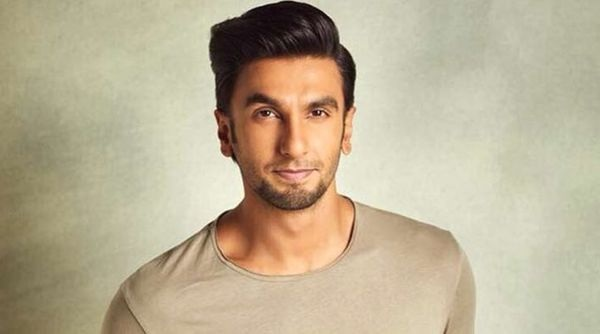
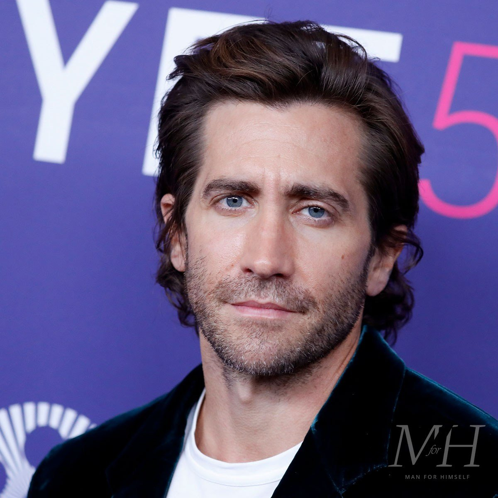
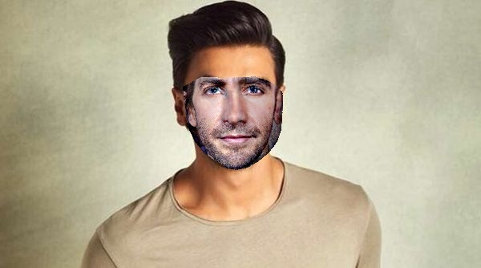

# 🧑‍🤝‍🧑 Face Swap with Python, OpenCV & dlib

This project performs face swapping using `OpenCV`, `dlib`, and Python. It detects landmarks, aligns faces, blends color tones, and outputs a natural-looking swapped face.

---

## 🖼️ Demo

### ▶️ Input Faces
| face1.jpg | face2.jpg |
|-----------|-----------|
|  |  |

### ✅ Swapped Result


---

## ⚙️ Setup Instructions

### 1. 📦 Create and Activate a Virtual Environment

```bash
python -m venv venv


Activate the virtual environment:

On Windows:
venv\Scripts\activate

On macOS/Linux:
source venv/bin/activate


✅ Install CMake
Windows
Download CMake from: https://cmake.org/download/

Run the installer.

✅ During installation, make sure to select “Add CMake to system PATH”.

After installation, restart your terminal/IDE and try again.

cmake --version


pip install opencv-python dlib numpy

pip freeze > requirements.txt